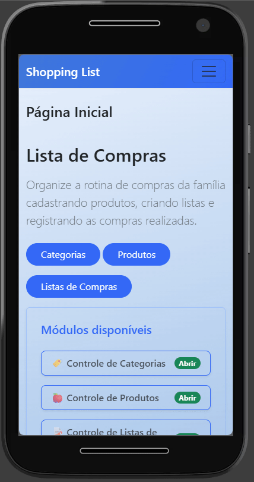

# 🛒 Lista de Compras

<p align="center">
  
</p>

## Funcionalidades

### 🏷️ 1. Módulo de Categorias

<p align="center">
  
</p>

**Requisitos Funcionais**

- O sistema deve permitir cadastrar novas categorias
- O sistema deve permitir visualizar todas as categorias
- O sistema deve permitir editar categorias existentes
- O sistema deve permitir excluir categorias

**Regras de Negócio**

Campos obrigatórios:

- Nome (texto único, máximo 50 caracteres)
- Cor (seleção de paleta ou hexadecimal)

> ** O sistema não deve permitir categorias com nomes duplicados  
> ** O sistema não deve permitir excluir uma categoria que tenha produtos vinculados

---

### 🍎 2. Módulo de Produtos

<p align="center">
  
</p>

**Requisitos Funcionais**

- O sistema deve permitir cadastrar novos produtos
- O sistema deve permitir visualizar todos os produtos cadastrados
- O sistema deve permitir editar produtos existentes
- O sistema deve permitir excluir produtos

**Regras de Negócio**

Campos obrigatórios:

- Nome (2 a 100 caracteres)
- Categoria (seleção obrigatória)
- Unidade de medida (ex: kg, unidade, litro, caixa)
- Preço aproximado

> ** O sistema não deve permitir produtos com o mesmo nome na mesma categoria

---

### 📝 3. Módulo de Listas de Compras

<p align="center">
  
</p>

**Requisitos Funcionais**

- O sistema deve permitir criar novas listas de compras
- O sistema deve permitir visualizar todas as listas
- O sistema deve permitir editar listas existentes
- O sistema deve permitir excluir listas

**Regras de Negócio**

Campos obrigatórios:

- Nome da lista (mínimo 3 caracteres, máximo 100)
- Data de criação (automática)
- Status possíveis: Aberta / Concluída

> ** O sistema não deve permitir excluir uma lista que já tenha itens vinculados  
> ** O sistema deve exibir o total de itens e o total estimado gasto de cada lista

---

### 🛍️ 4. Módulo de Itens da Lista

<p align="center">
  
</p>

**Requisitos Funcionais**

- O sistema deve permitir adicionar itens a uma lista de compras
- O sistema deve permitir visualizar todos os itens de uma lista
- O sistema deve permitir remover itens de uma lista
- O sistema deve exibir a categoria do produto ao selecionar um item para a lista

**Regras de Negócio**

Campos obrigatórios:

- Produto (seleção obrigatória)
- Quantidade (número positivo)

> ** O sistema não deve permitir adicionar o mesmo produto duas vezes na mesma lista  
> ** O valor total da lista deve ser calculado automaticamente (soma dos preços estimados x quantidades)

---

## Como utilizar

1. Clone o repositório ou baixe o código fonte.
2. Abra o terminal ou prompt de comando e navegue até a pasta raiz.
3. Utilize o comando abaixo para restaurar as dependências do projeto:

    ```bash
   dotnet restore
   ```
4. Para executar o projeto compilando em tempo real

   ```bash
   dotnet run --project ListaDeComprasWeb.WebApp
   ```

## Requisitos

- .NET 10.0 SDK

## 👩‍💻 Colaboradores

1. Natália Bortoli Vieira - [@nataliavieirab](https://github.com/nataliavieirab)
2. Júlia Hartmann - [@JuliaaHartmann](https://github.com/JuliaaHartmann)
3. Revisado pela [Academia do Programador](https://academiadoprogramador.com.br)